# Data flow and trust boundaries

Target design, 2026-09-06. The voice, knowledge, gateway and module paths below are not implemented yet. See ADR 0004 and PLATFORM_CONTRACTS.

```mermaid
flowchart LR
  Caller["Caller: untrusted audio"] --> Edge["Verified telephony / local media adapter"]
  Edge --> Scope["Server-resolved tenant / business / location"]
  Scope --> Session["Core call state and media epochs"]
  Session --> Voice["STT / dialogue / TTS ports"]
  Voice --> Proposal["Untrusted response and action proposals"]
  Knowledge["Scoped approved evidence"] --> Voice
  Profile["Published business profile / module registry"] --> Session
  Proposal --> Module["Selected module: typed workflow / domain validation"]
  Module --> Gateway["Core policy / scope / freshness / confirmation gate"]
  Gateway --> DB["Atomic state + outbox + audit"]
  DB --> Executor["Scoped worker; reauthorize before effect"]
  Executor --> Adapter["Narrow adapter"]
  Adapter --> External["Mock first; approved POS / messaging / transfer later"]
  Adapter --> Result["Verified outcome or explicit uncertainty"]
  Result --> Session
  Proposal --> Output["Grounding / safe-output checks"]
  Result --> Output
  Output --> Voice
  Staff["Authenticated staff"] --> Admin["Core scope and role checks"]
  Admin --> Profile
  Admin --> Knowledge
```

Core contains generic session, evidence, capability and action contracts. Restaurant module contains menus, dishes, deterministic quoting and order state. Future modules implement their own domain reducers, tools and schemas. Modules cannot execute adapters directly. Internal scoped retrieval also validates authorization; direct model access to data/provider APIs is prohibited.

Trust boundaries: caller/provider input to verified routing; untrusted speech/retrieval/model text to policy and output controls; authenticated staff to scoped management; tenant configuration to reviewed module capabilities; committed database state to external effects. Provider IDs and caller IDs alone never authorize access. Typed call and service principals are separate from employee sessions.

A voice interruption invalidates obsolete output and confirmation evidence. Only final input tied to a fully delivered read-back can confirm the current action snapshot. A completed external action cannot be undone by clearing speech. Unknown results become reconciliation/escalation work.

Raw audio may contain unsolicited sensitive details. Recording is off by default; recording, marketing and preference consent are distinct. Apply minimization/redaction before persistence and evaluate provider retention before live use. A prompt alone cannot prevent a caller speaking payment data. No medical/allergy assurance, refunds or other original prohibited actions become available through a module.
