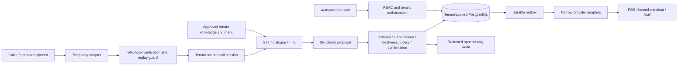

# Data flow and trust boundaries

Boundaries: public caller/provider input to verified adapter; model and retrieval output to trusted policy code; authenticated dashboard to tenant services; database transaction to external providers; application to third-party voice processing. Validate at each boundary. Telephony routing determines restaurant context from trusted configuration, never caller-provided tenant IDs. Credentials remain server-side.

Raw audio and transcripts may contain unsolicited sensitive data. Minimize capture, avoid recording by default, redact before persistence, and configure provider retention. A prompt alone cannot prevent a caller speaking card details. Provider data handling and legal review remain mandatory before live calls.
